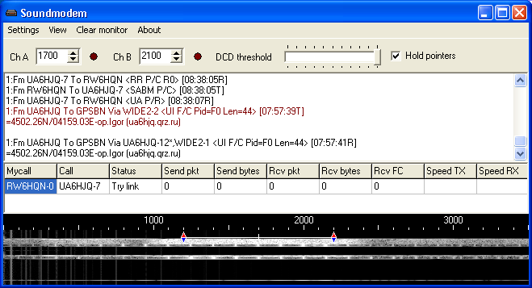
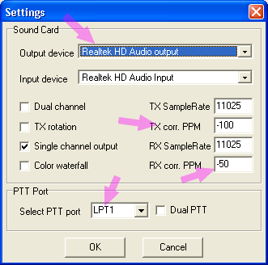
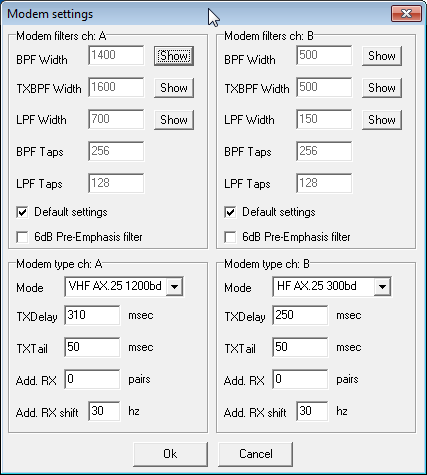
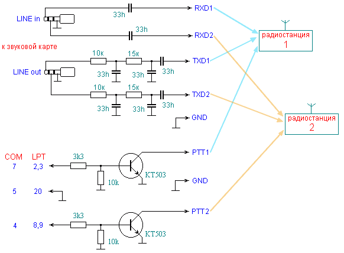
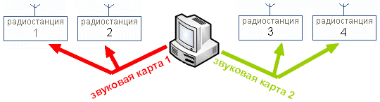

# UZ7HO sound modem

> Источник: http://goryham.qrz.ru/pr/uz7ho.htm
> Сохранено: 2026-09-24T10:02:17.080Z

Программа SoundModem написана Андреем UZ7HO, представляет собой программный двухпортовый TNC (типа КАМ+), заменяет AGWPE и может напрямую работать с такими известными программами как UI-VIEW32, Paxon, APRSIS32, UISS, WPP, BPQ32, APRS Messenger.

Мои эксперименты показали, что в реальном эфире UZ7HO Sound Modem принимает пакеты не хуже чем MILTIPSK, MixW, Flex32+soundmodem и не уступает Kantronics KAMplus и KPC-3plus. На сегодняшний день, эта одна из лучших программ эмулирующих TNC через звуковую карту и работающую по протоколу AX.25 на КВ и УКВ диапазонах.

UZ7HO модем имеет следующие возможности:

-   Может работать на скоростях 300, 600, 1200, 2400бод по протоколу AX.25
-   Поддерживает внутренние и внешние звуковые карты, в том числе и USB
-   Работает под Windows 98, 2000, XP, Vista, 7, 8
-   Не требует установки
-   Использует существующие драйверы для установленных звуковых карт
-   Имеет встроенные цифровые фильтры
-   Имеет программный шумомодавитель
-   Эмулирует SV2AGW packet engine, в режиме TCP и фактически заменяет его
-   Имеет два независимых порта, которые могут работать с разными скоростями
-   Для управления PTT использует COM или LPT порт
-   Можно использовать один COM/LPT порт для управления двумя радиостанциями
-   Позволяет вводить поправки для калибровки звуковой карты
-   Мониторинг пакетов из эфира без запуска дополнительных программ
-   Свои и чужие пакеты раскрашиваются в разные цвета
-   Фильтрация позывных и отдельных пакетов.
-   Поддерживает SignaLink USB модемы
    
    Программа Soundmodem постоянно совершенствуется и улучшается автором (UZ7HO Андрей), скачать последнюю версию можно с сайта [uz7.ho.ua](http://uz7.ho.ua/), радует что программа бесплатная, интерфейс английский. Уникальность программы заключается в простом интерфейсе, стабильной работе, возможности управлять двумя радиостанциями от одной звуковой карты, использовать более одной звуковой карты и тд.
    
      
    *внешний вид программы 'uz7ho sound modem' c одним каналом, а двухканальный смотрите [здесь](http://uz7.ho.ua/images/ax25/soundmodem.png)*
    
    На верхней картинке мы видим интерфейс программы (одноканальный режим работы), под заголовком окна расположены пункты меню, ниже центральные частоты каналов, правее ползунок DCD (шумоподавитель). Ниже большое мониторное окно, оно работает сразу после запуска программы и не требует сторонних приложений, это удобно, потому что сразу после запуска модема видно что происходит на частоте. Свои и чужие пакеты окрашиваются в разные цвета. Под мониторным окном находится окно статуса, оно показывает какие AX.25-соединения (не aprs) сейчас активны. Здесь одним взглядом видно статистику по кол-ву принятых и переданных пакетов и по трафику в байтах, для конкретного соединения. Очень удобная и уникальная возможность! Ниже окно с индикаторами настройки типа 'водопад', где видны сигналы из эфира. Если вы используете два канала, то и 'водопада' будет два. Их можно отключить. Кнопка Clear monitor очищает мониторное окно.
    
    Установка не требуется, достаточно распаковать архив и положить файлы в любое удобное место на диске (я использую путь C:\\Program Files\\soundmodem\\ ). После первого запуска файла soundmodem.exe будет создан файл soundmodem.ini в котором хранятся ваши настройки. Для удобства запуска, вы можете создать ярлык на рабочем столе или в меню Пуск. Чтобы повторить настройку с нуля, достаточно удалить файл soundmodem.ini.
    
    В режиме двух-канальной работы и включении всех опций, приложению требуется максимальная вычислительная мощность процессора, если работать с одним каналом и отключить 'водопад' (на УКВ он не нужен), нагрузка на процессор существенно снизится. Во время работы с программой, окно модема можно закрыть, но его иконка останется в трее.
    
      
    *меню Devices*
    
    В меню Devices устанавливается звуковая карта, PTT-порт, это может быть COM или LPT порт компьютера. Здесь же устанавливаются корректировки ppm для звуковой карты, после её калибровки, у каждой они свои. Пункт Dual PTT позволяет управлять двумя радиостанциями от одного COM или LPT порта. Обратите внимание, что если вы выберите LPT-порт, нужно дополнительно скачать файл lptwdmio.sys (с сайта автора) и положить в папку где находится soundmodem.exe. Опция Single channel output нужна если вы используете звуковую карту в режиме МОНО (одноканальный режим работы).
    
    Калибровку звуковой карты можно провести с помощью программы [CheckSR.exe](http://www.pa-sitrep.com/NBEMS/fldigi_calibration.htm), скачайте её, запустите и ждите 15-20 минут, пока не стабилизируются показания. Затем впишите полученные значения в пункты TX corr. и RX corr.
    
      
    *меню Modems*
    
    В меню Modems можно сделать установки под свои требования. Например, настроить цифровые фильтры, хотя (в большинстве случаев) настройки по умолчанию можно считать оптимальными. Важно установить правильно параметры виртуального TNC, в первую очередь это скорость, 300бод для КВ или 1200бод для УКВ. Не стандартный режим 600бод, позволит, при хорошем прохождении и небольших помехах на КВ, увеличить скорость обмена в два раза. Например, при форвардинге между BBS на частотах выше 14МГц. Второй важный пункт TXDelay он зависит от скорости переключения TX/RX вашей радиостанции и скорости срабатывания SQL (шумоподавителя) на станции корреспондента. Для УКВ можно начать со значений 300 - 400msec.
    
    Пункты Add.RX и Add.RX shift просто уникальны, они включают дополнительные декодеры, которые могут улучшить прием станций находящихся в стороне, что актуально для КВ. Например, по 1-2 пары, через 15-20гц. Правда, это дополнительная нагрузка на процессор компьютера.
    
    Опция 6db Pre-Emphasis filter позволяет скорректировать завал высоких частот в некоторых радиостанциях и тем самым улучшить качество приёма слабых сигналов из эфира.
    
    В разделе About, вы увидите название программы, номер текущей версии, информацию об авторе и год выпуска.
    
    Фильтрация позывных организована не через меню, а через редактирование INI-файла. В строку ExcludeCallsigns= можно вписать позывные через запятую, которые нужно отфильтровать. Например: ExcludeCallsigns=RN6HDE,RZ6HDD
    
    Фильтрация пакетов осуществляется через ExcludeAPRSFrmType= в INI-файле. Здесь нужно вписывать десятичный ASCII код пакета. Например: ExcludeAPRSFrmType=125 (это символ **}**) после чего soundmodem только помечает зеленым цветом эти пакеты на мониторе, не передавая их приложению. Список кодов вносим также через запятую. Ниже пакет который будет отфильтрован приведённой командой.
    
    08:04:19T EA6XQ>>APU25N,IW4EGP-4\*,MB7UXN-10\*,WIDE2\* Port=2 :
    }IW8RPQ-3>>APU25N,TCPIP,EA6XQ\*::IW8RPQ-4 :?APRSS
    
    Для управления двумя радиостанциями от одной звуковой карты и одного порта, нужно собрать простой интерфейс. Один из вариантов вы видите ниже. Простейшие фильтры для TXD, нужны чтобы хоть немного подавить гармоники, которыми так богат звуковой НЧ-сигнал выходящий из компьютера. Номиналы резисторок и конденсаторов можно менять в небольших пределах. Как вариант, можно рекомендовать [схему на трансформаторах](http://goryham.qrz.ru/digi/interface-tr.htm), она обеспечивает полную гавальническую развязку компьютера от радиостанции, исключает взаимные помехи и наводки, что актуально на КВ. Важно выбрать оптимальные уровни звука через вашу звуковую карту, так как от этого зависит качество приёма и передачи!
    
      
    *интерфейс для управление двумя радиостанциями от одной звуковой карты и одного COM или LPT порта*
    
    Если у вас подключена одна радиостанция, схема уменьшается в два раза. Детали размещаются внутри корпуса COM (9pin) или LPT разьёма, места там достаточно. Цифры на картинке, это номера ножек на разьёмах, в случае с LPT используйте одну из двух (какую удобнее) указанных ножек. Использовать LPT-порт выгоднее, так как COM останется свободным для подключения, поворотного устройства или внешнего TNC, а на многих современных платах COM-порт уже отсутствует. Один из вариантов интерфейса на трансформаторах [на этой фотографии](images/uz7ho6.jpg).
    
    Для того чтобы два канала принимали и передавали пакеты независимо друг от друга, звуковая карта вашего компьютера должна быть дуплексной, со стерео входом для микрофона, в некоторых картах у микрофона делают моно вход. Обратите на это внимание! При подключении к такой карте, оба 'водопада' показывают совершенно одинаковую картинку.
    
    Обратите внимание, что при использовании COM/LPT портов для управления PTT, когда программа UZ7HO Sound Modem не запущена, сигналы на указанных пинах могут быть произвольными и включить радиостанцию на передачу! Поэтому, когда модем не используется, выключайте радиостанцию или отсоединяйте её от PTT разьёма.
    
    UZ7HO Sound Modem отлично подходит для создания крупного КВ-УКВ узла, шлюза, BBS. Для этого используются две звуковые карты и две одновременно запущенных программы. Чтобы не было конфликтов между модемами вы должны в файле soundmodem.ini изменить строку Port=8000 на Port=8001 и внести соответствующие изменения в программу с которой работает UZ7HO Sound Modem. Теперь вы имеете 4 TNC и можете подключить к ним КВ-УКВ радиостанции в любых комбинациях. Например, BBS для форвардинга может иметь два КВ порта + два УКВ порта и тд. Внешний вид двухканального интерфейса смотрите [на фото](images/uz7ho7.jpg).
    
      
    *две звуковые карты управляют четырьмя радиостанциями*
    
    Кратко рассмотрим подключение UZ7HO Sound Modem к известным радиолюбительским программам, на конкретных примерах:
    
    **UISS**  
    Описывемый здесь модем отлично работает с программой [UISS](http://goryham.qrz.ru/pr/aprs/uiss.htm). Чтобы их состыковать, установите UISS, кликните по её иконке на рабочем столе, правой кнопкой мыши, выберите пункт *Свойства*, в строке *Обьект:* допишите параметр */LAN* после кавычек. Сначала запустите UZ7HO sound modem, а затем UISS, она сама найдет модем. Дальнейшие настройки программы делайте [по инструкции](http://goryham.qrz.ru/pr/aprs/uiss-setup.gif).
    
    **UI-View32**  
    Запускаем модем, теперь запускаем [UI-View32](http://goryham.qrz.ru/pr/aprs/uiview.htm), заходим в *Setup*, далее *Comms Setup*, выбираем *Host mode: AGWPE*. Всё! Напоминаю, что программу agwpe использовать не нужно, UZ7HO Sound Modem полностью заменяет её.
    
    **DIXPRS**  
    Интересный проект кроссплатформенного шлюза (iGate). Автор Bela Markus (HA5DI). программа полностью поддерживает модем UZ7HO, по умолчанию она сразу с ним начинает работать. Никакие установки делать не нужно. Подробное описание смотрите в статье: '[DIXPRS - aprs шлюз](http://goryham.qrz.ru/pr/aprs/dixprs.htm)'.
    
    **QAPRS**  
    Интересный, но пока сырой проект Алексея UA3MQJ под названием [QAPRS](http://code.google.com/p/qaprs/). Работает немного не стабильно, некоторые опции не работают. Попробовать можно, но для постоянного использования не подойдёт. Скачиваете QAPRS, устанавливаете, запускаете. Первым делом, заполняете данные о своей станции, затем идёте в закладку 'Порты' далее 'Создать порт' затем выбираете тип 'AGW CORE'. После этого программа работает через UZ7HO Sound Modem.
    
    **APRS-Beacon**  
    Простая но запутанная программа, которая может только передавать aprs маяки. Кликаем по кнопке Setup, далее Communication и выбираем AGWPE. На этом настройка закончена. Программа давно не обновлялась, видимо проект закрыт.
    
    **UI-Instant Messenger (aprs-пейджер)**  
    Простенькая и удобная программа для передачи маяков и обмена короткими сообщениями через APRS сеть. Можеть работать по эфиру или через APRSIS. Почитать описание и скачать настроенную версию можно [здесь](http://goryham.qrz.ru/pr/aprs/uiim.htm).
    
    **APRS Messenger**  
    Интересная [программа](http://www.crosscountrywireless.net/aprs_messenger.htm), которая только в начале развития, она позволяет обмениваться APRS пакетами на КВ в режимах PSK, QPSK, GMSK. UZ7HO Sound Modem работает с ней в режиме приёма. Подключение заключается в запуске модема, последующем запуске программы и нажатии кнопки с надписью UZ7HO, на верху. Всё просто....
    
    **APRSISCE/32**  
    Запускаем [программу aprsis32](http://aprsisce.wikidot.com/start), идём в Configure - Ports - New Port... В открывшемся окне выбираем AGW и присваиваем порту имя (например: uz7ho modem). Выбираем Configure TCP/IP port. Вписываем IP: 127.0.0.1 и Port: 8000 жмём ОК, на этом подключение модема к программе закончено.
    
    **Paxon**  
    Сначала запускаем модем, затем [Paxon](http://goryham.qrz.ru/pr/paxon.html). Идём в *Settings* далее *Devise*. Жмём *Add* и выбираем AGWPE. Жмём на *Apply* и перезагружаем программу. Теперь, при нажатии кнопки Connect в окне Channels вы увидите один или два порта модема. Вы можете даже одновременно подключить к Paxon Flex32 и UZ7HO Sound Modem.
    
    **BPQ32**  
    Чтобы состыковать модем с bpq, прочитайте статью [UZ7HO Sound Card Modem Driver for BPQ32 switch](http://www.cantab.net/users/john.wiseman/Documents/UZ7HODriver.htm). Там приводится описание для двух-канального варианта со всеми необходимыми подробностями.
    
    Ссылки по теме:  
    • [Домашний сайт UZ7HO](http://uz7.ho.ua/)  
    • Обсуждение на форумах: [qrz.ru](http://forum.qrz.ru/showthread.php?p=630381) , [cqham.ru](http://www.cqham.ru/forum/showthread.php?t=19727)  
    • [Пакетная связь без TNC](http://goryham.qrz.ru/pr/bez-tnc.htm)  
    • [APRS на Северном Кавказе](http://goryham.qrz.ru/pr/aprs/aprs.htm)  
    • [Трансформаторный интерфейс для цифровых видов связи](http://goryham.qrz.ru/digi/interface-tr.htm)  
    • [Универсальная пакетная система в Windows](http://goryham.qrz.ru/pr/1/ax25win.htm)
    
  **Настройка программы для APRS**
  
  Откройте программу SoundModem и настройте канал (Модем A): 
  * Mode (Режим): AFSK AX.25 1200bd.
  * Фильтры (настройки частот по умолчанию): левая частота (Mark): 1200 Гц
  * Фильтры (настройки частот по умолчанию): правая частота (Space): 2200 Гц
  * Фильтры (настройки частот по умолчанию): центральная частота (Center): 1700 Гц
  * Степень дискретизации (Sample Rate): (рекомендуется 11025 Гц или 44100 Гц).
    
  Settings -> Modem settings:
  * TXDelay: Рекомендуется установить от 250 до 350 мс (а для некоторых радиостанций Baofeng, у которых медленно открывается шумоподавитель — до 400-500 мс)
  
  Радиостанция:
  * Режим работы встроенного модема должен быть настроен на скорость 1200 bps.
  * Шумоподавитель (Squelch) на радиостанции должен быть настроен на минимальный порог, чтобы не «съедать» начало пакета.
