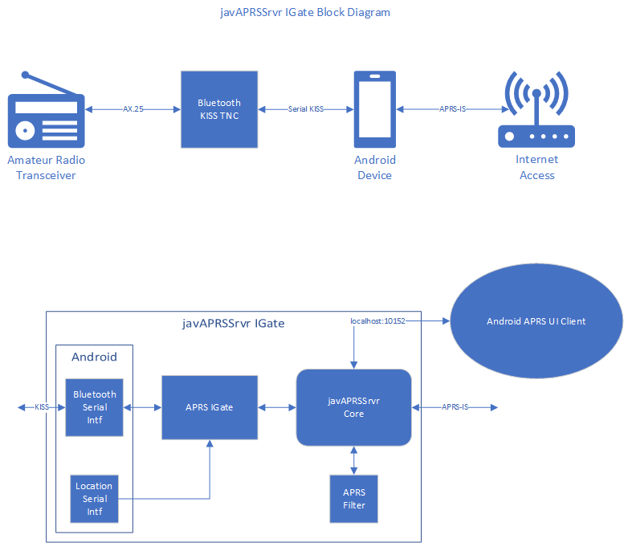
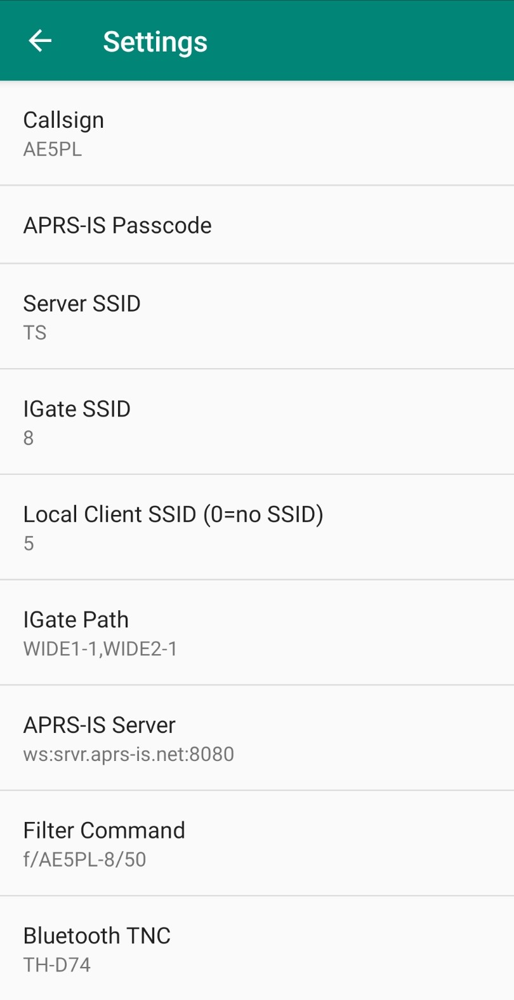

### javAPRSSrvr IGate

[original here](http://www.ae5pl.net/javAPRSSrvrIGate.aspx) | [русский](Russian.md) | [english](Readme.md)    

**javAPRSSrvr** IGate is an <a href="https://play.google.com/store/apps/details?id=net.ae5pl.javaprssrvrigate">Android app</a> designed to add APRS IGate functionality to an Android device running Oreo or later operating system.
    This app is <b>not</b> designed to be a hands-on app.  It is designed to run as a service and supports UI apps such as APRSDroid.
    The internal UI app (such as APRSDroid) connects to the server portion of javAPRSSrvr IGate as a local APRS-IS server so no modifications are necessary other than redirecting the client's APRS-IS connection.
        javAPRSSrvr is described at <a href="http://www.aprs-is.net/javAPRSSrvr">APRS-IS javAPRSSrvr</a>.  More information on APRS-IS can be found at <a href="http://www.aprs-is.net">APRS-IS Web Site</a>

    

        Below is the Settings screen and each entry is described in detail below.
    

    
    <ul >
        <li style="margin-top:10px">*<strong>Callsign:</strong> Enter your licensed amateur radio callsign.</li>
        <li style="margin-top:10px">*<strong>Passcode:</strong> Enter your APRS-IS passcode. javAPRSSrvr IGate requires that you be a licensed amateur radio operator. 
            If you do not have an APRS-IS passcode, you may email me directly with your Google Play email address, your licensed amateur radio callsign, your full name and mailing address.</li>
        <li style="margin-top:10px">*<strong>Server SSID:</strong> Enter a one or 2 alphanumeric SSID for the server. This defaults to IG and is used to identify the server to APRS-IS. <strong>Must be unique.</strong></li>
        <li style="margin-top:10px">*<strong>IGate SSID:</strong> Enter a number from 1 to 15 or change to blank for zero. The default is 10. This is used to identify the IGate to RF users and to APRS-IS. <strong>Must be unique.</strong></li>
        <li style="margin-top:10px"><strong>Local Client SSID (0=noSSID):</strong> This is the SSID of the local APRS client you are connecting to javAPRSSrvr IGate. If the local client does not have a SSID, enter 0. The default is empty to indicate no local client is attached. <strong>Must be unique.</strong></li>
        <li style="margin-top:10px">*<strong>IGate Path:</strong> This is the path used on RF. Default is WIDE1-1,WIDE2-1.</li>
        <li style="margin-top:10px"><strong>APRS-IS Server:</strong> This is the address and port of the upstream server. The following formats are allowed:
            <ul>
                <li><strong>WebSocket (not all APRS-IS servers support this):</strong> ws://server[:port]/ or wss://server[:port]/ (wss=secure)</li>
                <li><strong>TCP:</strong> server:port</li>
            </ul>
            Default is ws://srvr.aprs-is.net:8080/</li>
        <li style="margin-top:10px">
            <strong>Filter Command:</strong> This is used to tell the upstream server what filter to use. 
            I recommend f/IGATE-SSID/50 where IGATE-SSID is the your callsign and IGate SSID to provide all stations within 50 km of your location. Do <strong>NOT</strong> use the server SSID as the server never transmits a position; only the IGate transmits a position. 
            More filter commands can be found at <a href="http://www.aprs-is.net/javAPRSFilter.aspx">APRS Filter Commands</a>
        </li>
        <li style="margin-top:10px">*<strong>Bluetooth TNC:</strong> This is the Bluetooth KISS TNC you will be using (connected HG-UV98). The TNC must already be paired and placed into KISS mode before starting javAPRSSrvr IGate.</li>
    </ul>
    

        * indicates Required.
    

    <h2>Button Operation</h2>
    

        There are 2 buttons that are very important to the operation of javAPRSSrvr IGate.

    <ul>
        <li><strong>Start</strong> This buttons starts the IGate process.</li>
        <li><strong>Shutdown</strong> This button shuts javAPRSSrvr IGate down completely. This frees up all resources immediately. It does prompt before closing to ensure no accidental touches.</li>
    </ul>
    <h2>Connecting an UI App to javAPRSSrvr IGate</h2>
    

        Because javAPRSSrvr IGate is based on javAPRSSrvr, it provides APRS-IS server ports for localhost attachment. It is limited to localhost to protect you from outside connections.
        javAPRSSrvr IGate supports two ports, 10152 which is a full feed of every non-dupe packet that passes through it and 14580 which is a user-defined filter port.
    You can configure your UI client (such as <a href="https://aprsdroid.org/">APRSDroid</a> or <a href="https://www.oruxmaps.com/cs/en/">OruxMaps</a> to connect to either port. If you wish to connect to port 14580, please see <a href="http://www.aprs-is.net/javAPRSFilter.aspx">APRS Filter Commands</a> for information on filters you can use.  
    Connection string for application: <b>localhost:14580</b> or <i>localhost:10152</i>
    

    <h3>javAPRSSrvr IGate is GA released at the <a href="https://play.google.com/store/apps/details?id=net.ae5pl.javaprssrvrigate">Google Play Store</a>.</h3>
